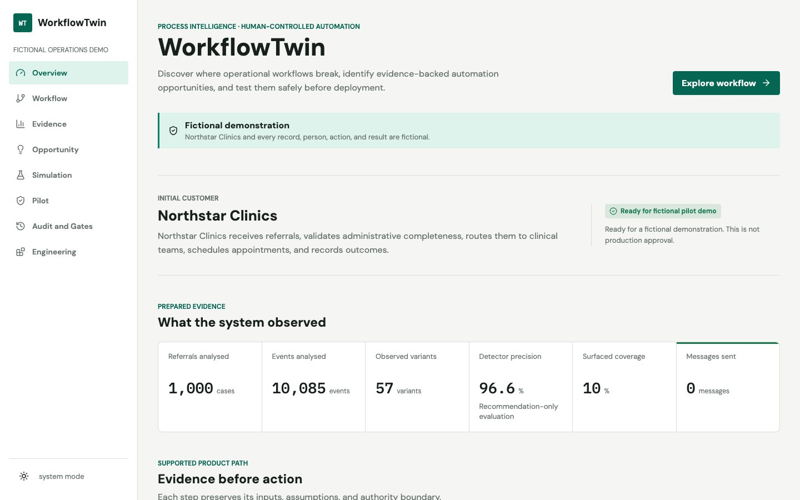
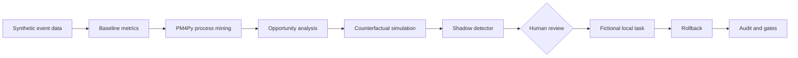
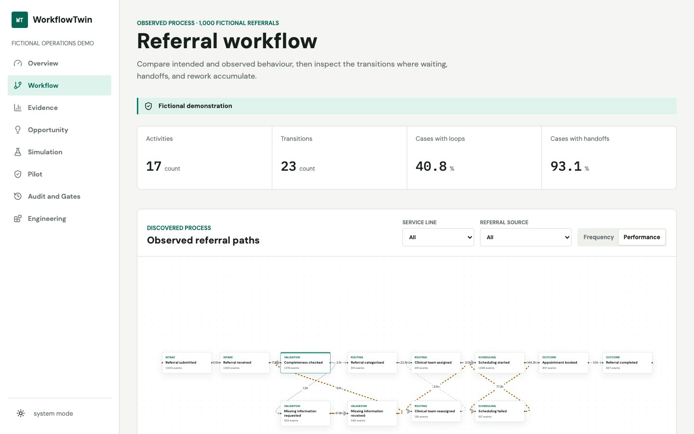
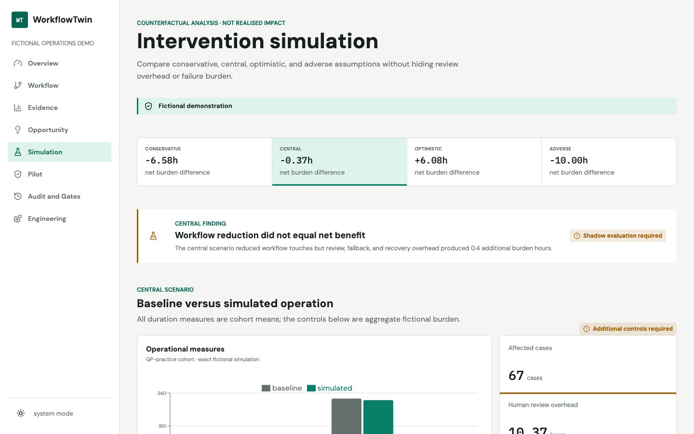
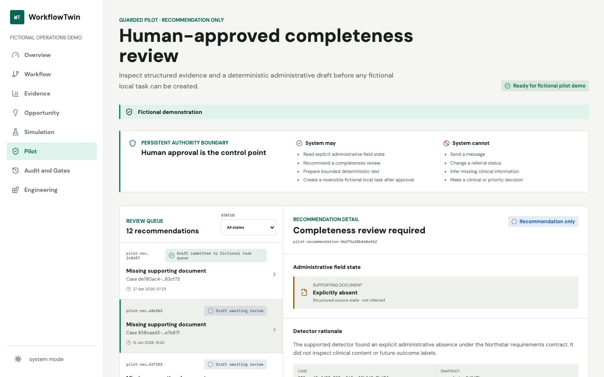
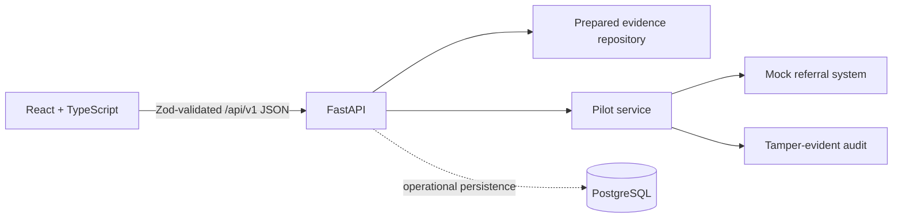

# WorkflowTwin

**Discover where operational workflows break, identify evidence-backed automation opportunities,
and test them safely before deployment.**

[Open the live fictional demo](https://workflowtwin.vercel.app) ·
[API documentation](https://workflowtwin.vercel.app/docs) ·
[Portfolio case study](docs/portfolio/workflowtwin-case-study.md) ·
[3-minute demo script](docs/portfolio/demo-script.md)



WorkflowTwin is a recruiter-facing AI engineering and process-intelligence product. It reconstructs
an operational workflow, quantifies friction, selects an automation opportunity, tests it through
counterfactual simulation and shadow evaluation, and demonstrates a reversible human-approved
fictional action.

> **Fictional demonstration:** Northstar Clinics and every referral, person, event, interview,
> action, metric, and result are fictional or synthetic. WorkflowTwin handles administrative
> workflow evidence only. It does not diagnose, prioritise clinical urgency, recommend treatment,
> or claim real customer outcomes.

## The operational problem

Fictional UK provider **Northstar Clinics** receives referrals, checks required information,
requests missing items, categorises and assigns work, schedules appointments, notifies patients,
and records outcomes. The intended path is simple; the observed process contains incomplete
submissions, repeated checks, slow handoffs, rework, failed scheduling, and stuck cases.

WorkflowTwin answers four decision questions:

1. What process actually happened, including variants, loops, waits, and handoffs?
2. Which bottleneck has enough evidence and bounded risk to justify investigation?
3. Does an intervention still look useful after review overhead and adverse assumptions?
4. Can a human approve, audit, deduplicate, and reverse a fictional action without any send ability?

## Product flow



The interface has eight focused views:

| View | What it makes inspectable |
| --- | --- |
| Overview | Northstar problem, product journey, headline findings, and authority boundary |
| Workflow | Interactive process graph, delays, loops, handoffs, variants, and conformance |
| Evidence | Baseline metrics, cohort comparisons, quality, coverage, and exclusions |
| Opportunity | Selected completeness review, provenance, controls, gaps, and rejected alternatives |
| Simulation | Conservative, central, optimistic, and adverse counterfactual results |
| Pilot | Recommendation evidence, bounded draft editing, approval, fictional task, and rollback |
| Audit and Gates | Hash-chain verification, safety evidence, policy thresholds, and assessment |
| Engineering | Runtime architecture, stack, ADRs, evaluation history, and limitations |



## Evidence and results

The fixed demonstration contains 1,000 referrals, 10,085 events, 17 activities, 23 transitions,
and 57 observed variants. GP-practice referrals show 51.8% fictional first-pass completeness versus
67.8% overall. The selected opportunity is a deterministic intake completeness review.

Simulation does not manufacture a success story: the central scenario adds approximately 0.4 hours
of net fictional burden once human review, fallback, and recovery overhead are included. That result
requires shadow evaluation rather than workflow action.

The supported fictional pilot reports:

| Measure | Result |
| --- | ---: |
| Detector precision / recall | 96.6% / 80.0% |
| Detector-positive / surfaced coverage | 24.2% / 10.0% |
| Human reviews | 3 |
| Fictional local task commits / verified rollbacks | 2 / 1 |
| External messages / operational mutations | **0 / 0** |
| Assessment | `ready_for_fictional_pilot_demo` |

These are deterministic synthetic benchmark results, not observed operational or commercial impact.



## Human control

The system reads explicit administrative field state, recommends a review, and creates a
deterministic missing-information draft. A permitted fictional reviewer can edit, request context,
mark unnecessary, reject, cancel, or approve. Clinical and identifying content is rejected.

Approval creates only an in-memory mock task marked `ready_for_manual_sending`. There is no address,
external adapter, send endpoint, or send button. Idempotency prevents duplicate creation. Rollback
requires a reason, restores the mock state, preserves history, and appends a fingerprint-linked audit
record.



The policy gates safety, detector quality, reviewer capacity, auditability, and reliability.
`ready_for_fictional_pilot_demo` is not production approval.

## Architecture

WorkflowTwin is a Python 3.12 modular monolith with a static React client:



- **Frontend:** React, TypeScript, Vite, React Router, TanStack Query, Zod, React Flow, Recharts.
- **Backend:** FastAPI, Pydantic, SQLAlchemy, Alembic, PostgreSQL, structlog.
- **Analysis:** deterministic synthetic generation, metric contracts, PM4Py, opportunity rules,
  counterfactual simulation, recommendation-only evaluation.
- **Quality:** pytest, branch coverage, strict mypy, Ruff, Vitest, React Testing Library, Playwright,
  Axe, schema-drift checks, Docker health checks.
- **Observability:** request IDs, structured request logs, status/duration/error classification,
  `/health`, `/ready`, and safe `/api/v1/system/status` metadata.

Prepared API payloads are compact, deterministic, path-free, and exclude hidden evaluation labels.
TanStack Query owns server state; React state is limited to presentation and unsaved form input.

Read [frontend and deployment architecture](docs/architecture/frontend-and-deployment.md),
[ADR 0012](docs/decisions/0012-frontend-productisation.md), and the complete
[architecture index](docs/architecture/technical-architecture.md).

## Evaluation journey

The product keeps negative results visible. `strict-v1` had strong precision but inadequate recall.
`strict-v2` reduced false-positive burden, but recall fell to 51.19% on its frozen holdout. A new
source contract improved observability; `strict-v3` reached 78.39% validation recall but exceeded
its pre-registered 25% detector-coverage cap at 25.83%. Its holdout remains unopened.

The supported alias `completeness-review-detector-v1` retains that lineage. A separate pilot policy
caps surfaced workload at 10%; it does not rewrite the failed V3 result. See the
[detector evolution](docs/experiments/shadow-detector-evolution.md).

No LLM is used. Explicit requirements and deterministic administrative text are easier to evaluate,
constrain, reproduce, and audit for this task.

## Run locally

Requirements: Python 3.12, [uv](https://docs.astral.sh/uv/), Node.js 22, and optionally Docker.

```bash
uv sync --extra dev
uv run workflowtwin demo
uv run workflowtwin serve

# second terminal
cd apps/web
npm ci
npm run dev
```

Open the frontend at `http://localhost:5173` and API docs at `http://localhost:8000/docs`.
Use `uv run workflowtwin demo --reset` to rebuild deterministic artefacts, or
`uv run workflowtwin demo --skip-heavy-analysis` for the fast preparation path.

Root shortcuts:

```bash
make api     # FastAPI development server
make web     # Vite development server
make dev     # full production-like Docker stack
```

## Docker

```bash
docker compose up --build
```

Default URLs:

- Product: `http://localhost:3000`
- API docs: `http://localhost:8000/docs`
- Health: `http://localhost:8000/health`

Set `WEB_PORT` or `API_PORT` when those ports are occupied. Compose runs the Nginx frontend,
FastAPI, and PostgreSQL with dependency-aware health checks.

## Validate

```bash
uv run pytest --cov
uv run ruff check .
uv run ruff format --check .
uv run mypy src tests alembic scripts
uv lock --check

cd apps/web
npm run lint
npm run typecheck
npm run test
npm run build
npm run test:e2e
```

The release has more than 200 Python tests plus frontend unit, component, accessibility, responsive,
failure-recovery, and end-to-end workflow coverage. See the final validation report in
`docs/portfolio/validation-report.md` after release validation.

## Deployment

The verified demo is deployed from `vercel.json` at
[workflowtwin.vercel.app](https://workflowtwin.vercel.app). A multi-stage `Dockerfile.deploy` and
`render.yaml` provide a unified container alternative. The public runtime is ephemeral, may cold
start, and is not multi-user infrastructure. Bounded revision/action replay verifies deterministic
identifiers across recycled function instances. Anonymous reset is disabled; local reset remains
available and a configured token can enable operator reset.

See [deployment details](docs/deployment.md).

## Repository map

```text
apps/web/                 React product and browser tests
src/workflowtwin/api/     Versioned HTTP contracts
src/workflowtwin/pilot/   Human review, mock action, rollback, audit, gates
src/workflowtwin/         Analytics, process mining, simulation, detector, persistence
tests/                    Python unit, integration, contract, and PostgreSQL tests
docs/architecture/        System and benchmark documentation
docs/decisions/           Architecture decision records
docs/portfolio/           Case study, demo script, interview notes, validation
```

## Limitations

- All data and results are synthetic; no clinical, causal, commercial, or customer claim is made.
- Point events can only estimate some waiting and processing intervals.
- Public pilot state is ephemeral and shared; audit views may return to prepared state on recycling.
- Reviewer roles are validated but not authenticated; authentication and multi-tenancy are out of
  scope.
- There are no real integrations, queues, messages, patient data, or autonomous workflow changes.
- The public Python bundle is approximately 431 MB, near Vercel's 500 MB function limit.

## Licence and dependency note

Repository code is currently marked proprietary. **PM4Py is AGPL-licensed**; commercial use or
distribution would require a dedicated legal and licensing review, potentially including a
commercial PM4Py licence or an alternative implementation. Other dependencies retain their own
licences.
