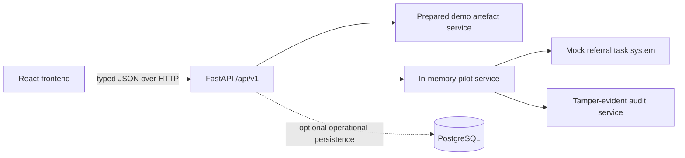
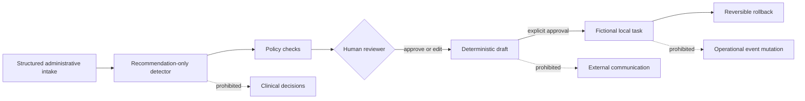
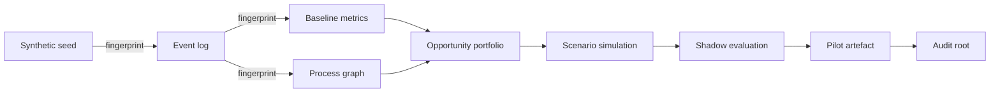

# Frontend and deployment architecture

## Product boundary

WorkflowTwin's product interface presents one supported, fictional Northstar Clinics
journey: prepared operational evidence leads to a recommendation-only detector, a
human-approved administrative draft, a reversible local task, and an auditable
rollback. It does not diagnose, prioritise patients, send messages, or mutate referral
events.

## Information architecture

The React application has eight primary routes:

| Route | Question answered |
| --- | --- |
| `/` | What is WorkflowTwin and what did it find? |
| `/workflow` | How does the referral process actually behave? |
| `/evidence` | Which operational measurements support the finding? |
| `/opportunity` | Why was completeness review selected? |
| `/simulation` | What changed under each counterfactual scenario? |
| `/pilot` | How does a reviewer control the fictional action? |
| `/audit` | Can the decision history and promotion gates be verified? |
| `/engineering` | How was the system designed and evaluated? |

Historical detector experiments remain supporting engineering evidence rather than
primary navigation.

## Runtime architecture

TanStack Query owns remote state, caching, retries, and mutation invalidation. Local
React state owns only view mode, graph selection, filters, dialog state, and theme.
There is no global client-state framework.

## API ownership

Immutable analytical presentation data is exposed through six typed, read-only
`/api/v1/demo` resources. Existing `/api/v1/pilot` routes remain the sole interface
for reviewer and mock-task mutations. `/api/v1/system/status`, `/health`, and
`/ready` provide operational status without disclosing secrets or filesystem paths.

The prepared presentation artefact is deliberately compact. It contains only the
statistics, graph elements, provenance labels, and engineering metadata needed by
the UI; hidden synthetic labels and raw event records are not served.

## Authority boundary

Public mutations operate on resettable fictional process memory. Identifiers are
validated, draft edits are bounded, clinical content is rejected, and no recipient
or send endpoint exists. A configured reset token is required outside local mode.
This is a portfolio demonstration, not multi-user production infrastructure.

## Data lineage

Each UI response carries a fictional-data declaration and relevant artefact
fingerprints. The UI never receives local paths.

## Development and production

Local development runs Vite and FastAPI separately, with Vite proxying `/api` and
health requests. Docker Compose adds PostgreSQL and serves a production frontend
build through Nginx. The verified Vercel setup uses a static Vite project rooted at
`apps/web` and a separate FastAPI project. The frontend receives the API origin through
`VITE_API_BASE_URL`; FastAPI allows only the configured frontend origin. The unified
Docker image and Render blueprint remain rebuildable container alternatives.

The deployed demo intentionally does not depend on persistent writable storage.
Prepared analytics are immutable and pilot state resets on restart or through the
guarded reset operation. This avoids pretending a free portfolio deployment has
production durability.

Serverless approval and rollback accept bounded fictional replay state so a fresh
instance can reconstruct the relevant revision and verify the same action,
idempotency, and mock-task identifiers atomically. Anonymous production reset is
disabled. The shared state and audit view can still return to prepared state after
instance recycling and are explicitly not multi-user infrastructure.

## Quality strategy

Vitest and React Testing Library cover contracts, view logic, controls, safety
messages, and mutation states. Playwright covers the recruiter walkthrough,
forbidden-content safety, API failure recovery, and responsive smoke paths. Existing
Python tests continue to cover the domain and API. Accessibility checks combine
semantic component tests, axe scans, keyboard-focused end-to-end checks, and manual
contrast and reduced-motion review.
