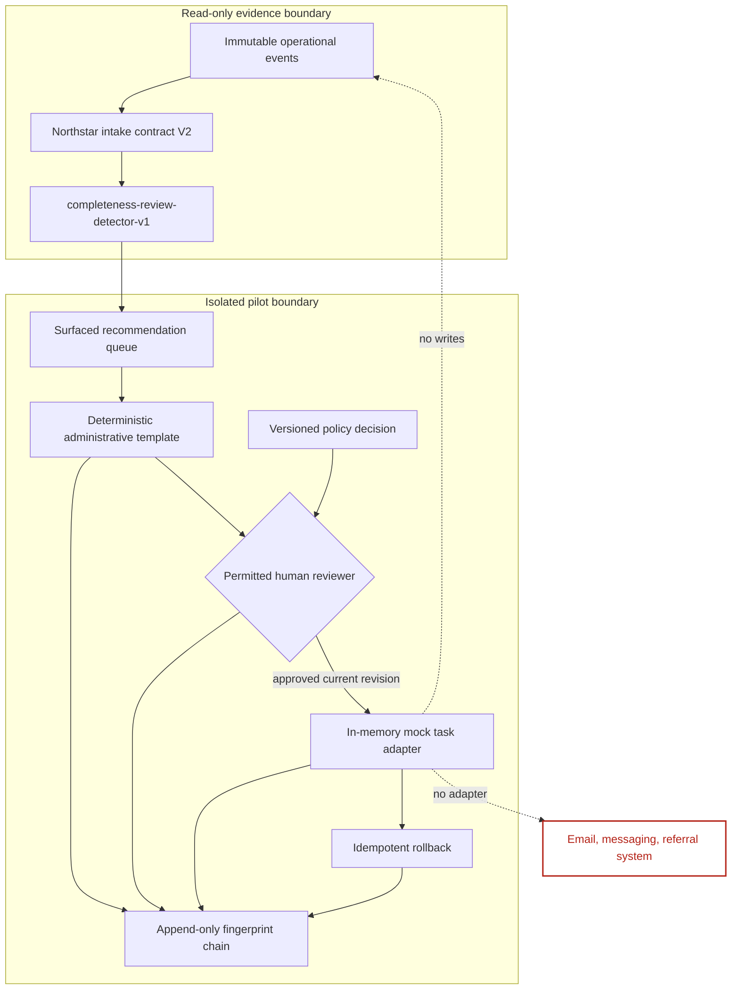
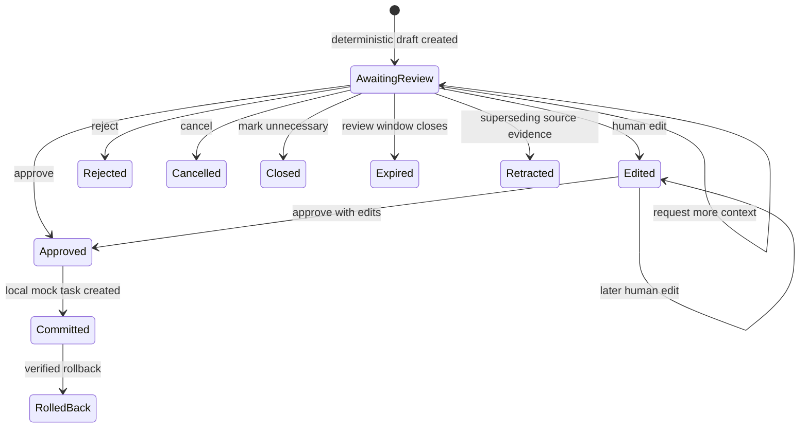

# Human-approved fictional pilot

## Scope

The pilot tests one limited administrative action: create a deterministic missing-information draft
for a fictional reviewer, then create a record in a local mock task system only after approval.
Northstar Clinics, all inputs, actors, actions, and results are fictional. The pilot is not a
production or clinical system.

## Supported boundaries



The detector accepts V2 snapshots, not labels, outcomes, clinical narrative, or an operational
writer. Synthetic truth is used only after detection to calculate offline quality metrics.

## Recommendation and approval sequence

```mermaid
sequenceDiagram
    participant D as Supported detector
    participant P as Pilot policy
    participant H as Human reviewer
    participant M as Local mock system
    participant A as Audit chain

    D->>P: Recommendation + source/requirements provenance
    P->>A: Record surfaced recommendation and deterministic draft
    H->>P: Edit current revision (optional)
    P->>A: Append immutable revision record
    H->>P: Explicit approve/reject/cancel decision
    P->>P: Validate role, expiry, revision, conflict, provenance, policy
    alt approved
        P->>M: Create task with stable idempotency key
        M-->>P: Created or duplicate suppressed
        P->>A: Record review and linked action
    else not approved
        P->>A: Record decision; no task created
    end
    Note over M: No message is sent and no referral event changes
```

Approval checks fail closed. A task is never created from a stale revision, expired draft,
unpermitted role, unresolved source conflict, incomplete provenance, or non-approval decision.

## Draft lifecycle



Revisions are append-only and retain the previous revision ID, editor role, timestamp, structured
reason, changed fields, content, and audit reference.

## Idempotency and rollback

An action key is a stable hash of recommendation ID, current draft revision, pilot policy version,
and action type. The mock adapter indexes this key before creating a task. Replayed approval returns
the existing task and records `duplicate_action_suppressed`.

```mermaid
sequenceDiagram
    participant H as Pilot supervisor
    participant P as Pilot service
    participant M as Mock task store
    participant A as Audit chain

    H->>P: Roll back action ID + reason
    P->>M: Resolve linked task
    M->>M: Append transition; preserve original record/history
    M-->>P: rolled_back
    P->>A: Append actor, reason, action and task links
    H->>P: Replay same rollback
    M-->>P: Existing rolled_back state
    P->>A: Append duplicate rollback suppression
```

Rollback works after task cancellation. Unknown actions fail clearly. Repeated rollback does not add
another state transition or destroy the original rollback record.

## Policy and stop conditions

The versioned policy separates detector-positive coverage from surfaced recommendation coverage.
The former describes all positive cases; the latter is the actual capacity-controlled reviewer
queue. Gates cover:

| Category | Required evidence |
|---|---|
| Safety | zero clinical access, external communication, operational mutation, and unapproved action |
| Detector quality | precision >=90%, recall >=72%, bounded false-positive review minutes |
| Reviewer capacity | surfaced coverage <=20%, queue/minutes/latency/expiry/backlog within bounds |
| Auditability | complete provenance, policy, review, action, rollback, and valid chain |
| Reliability | deterministic replay, idempotency, availability, bounded failures, rollback success |

Any safety, missing-policy, or audit-chain failure pauses the pilot. Quality or capacity failure
requires design revision or continued shadow-only evaluation. Passing authorises only the fictional
controlled demo.

## API and persistence

FastAPI constructs a deterministic pilot state at application startup. Typed `/api/v1/pilot`
routes expose reads and explicit review commands. The isolated `InMemoryMockReferralSystem` stores
task history for the process lifetime. PostgreSQL remains the operational event store, but the pilot
has no repository capable of changing `referral_events` or `referral_cases`.

This deliberate local design makes the safety claim inspectable. Durable pilot persistence,
authentication, permissions, recovery checkpoints, and real adapters require a separate production
design and are not implied by this milestone.
