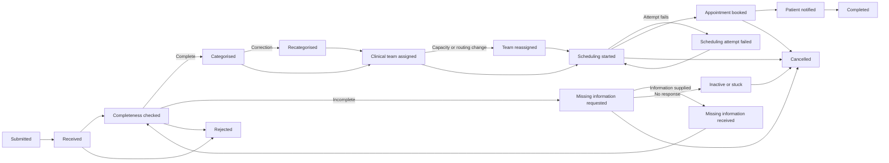

# Northstar referral workflow

Northstar Clinics is a fictional UK healthcare provider. Every organisation, staff member,
patient, referral, and event described by WorkflowTwin is fictional or synthetic. This model
covers administrative workflow only and contains no diagnosis, treatment decision, clinical
priority, patient risk score, protected medical narrative, or direct patient identifier.

## Expected lifecycle

The expected path is a reference for analysis, not a rule that incoming event logs must follow.

`COMPLETED`, `CANCELLED`, `REJECTED`, and `CLOSED_OTHER` are terminal lifecycle statuses. A
terminal case has a `closed_at` timestamp. A stuck case is not automatically terminal: it is an
analytical classification based on inactivity while the case remains open.

## Permitted deviations

WorkflowTwin preserves what source systems recorded. It does not reject an event merely because
it appears in an unusual order or repeats an earlier activity. Supported deviations include:

- repeated completeness checks and missing-information requests;
- recategorisation and reassignment, including several occurrences;
- failed or repeated scheduling attempts;
- cancellation or rejection from different open stages;
- patient non-response and extended inactivity;
- late ingestion and events ingested out of event-time order; and
- a duplicate source event, which is detected at persistence rather than silently stored twice.

An event's `event_at` is the source's claim about when the activity happened. Its `ingested_at` is
when WorkflowTwin accepted that record. Event-time order is used to reconstruct the workflow;
ingestion order is retained to explain data latency and revisions to an analysis. When timestamps
tie, analytical code will use the stable event identifier as a deterministic tie-breaker and must
not invent a causal ordering.

## Operational semantics

### Rework

Rework is an activity that repeats or corrects previously completed administrative work. Initial
rules will count repeated completeness checks after the first, every additional missing-information
request in the same information loop, recategorisation, team reassignment, and repeated scheduling
attempts. A repeated source record with the same external event identity is a duplicate, not rework.

### Handoff

A handoff occurs when responsibility moves between distinct actor identifiers or operational teams.
System-generated events and communication with a patient or referrer do not alone constitute an
internal handoff. Later analytics will infer handoffs from consecutive event-time-ordered events and
must report when actor identity is unavailable.

### Manual touch

A manual touch is one recorded event whose `requires_manual_work` flag is true. It represents an
administrative action, not effort duration. Automated system events are not manual touches, even if
a person initiated an earlier action in the same flow.

### Stuck cases

An open referral may be classified as stuck when no qualifying progress event occurs within the
service-level threshold defined for its current stage. Causes can include missing-information
non-response, unowned handoffs, unavailable appointments, failed scheduling, source-data gaps, or
an event that was never ingested. Thresholds are future analysis configuration; the stored lifecycle
status does not claim that a case is stuck.

## Active work and waiting

Event timestamps are point observations, so exact effort duration is unavailable in version 1.
Processing time will initially be estimated only when a defined start and end pair encloses active
work, such as `APPOINTMENT_SCHEDULING_STARTED` to `APPOINTMENT_BOOKED`. Waiting time is elapsed time
between a request or handoff and its response or next qualifying action, including:

- referral received to first completeness check;
- missing information requested to information received;
- team assignment to scheduling start; and
- scheduling start or failed attempt to appointment booking.

Unobserved time inside these intervals cannot be assigned confidently to active work or waiting.
Metrics must expose that limitation rather than force all case duration into either category.

## Immutability boundary

Referral events are append-only facts. Application contracts are frozen, SQLAlchemy rejects ORM
updates and deletes, PostgreSQL triggers reject direct updates and deletes, and the referral foreign
key uses `ON DELETE RESTRICT`. Duplicate source identity is enforced by the pair
`(source_system, external_event_id)`.

These are practical safeguards, not absolute immutability. A database owner can disable triggers or
alter data during exceptional recovery. Such intervention must be separately authorised, logged,
and followed by a new ingestion or audit record rather than presented as ordinary application use.

